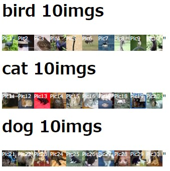

# __HTML Table Preview__



## __Overview__

画像パスとカテゴリを指定することで画像をHTML上に表示させることができます。

## __Requirement__

```text
-pic
 |-category_a
    |-a.jpg
    |-b.jpg
    |-c.jpg
 |-category_b
    |-i.jpg
    |-j.jpg
    |-k.jpg
 |-category_c
    |-x.jpg
    |-y.jpg
    |-z.jpg
  ...
```

## __Usage__

```text
python create_page.py [-d pic]
```

実行後に`preview.html`と`style.css`が作成されます。

## __Reference__

[CIFAR-10 dataset](https://www.cs.toronto.edu/~kriz/cifar.html)
